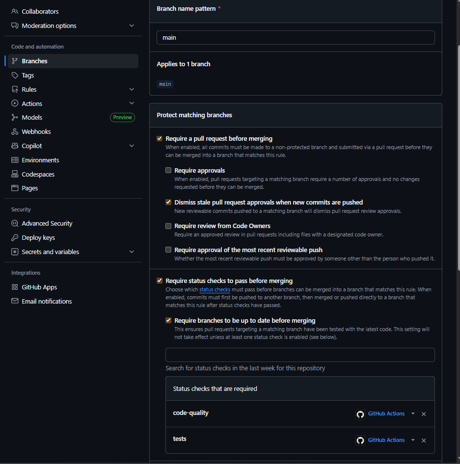
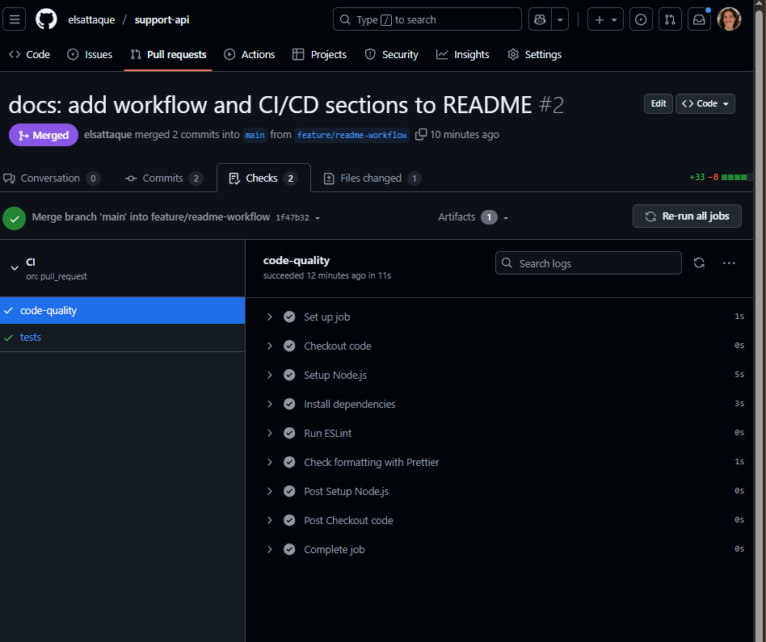

# Support API – README (Version Courte)

Ce fichier contient uniquement les informations **explicitement demandées** dans le sujet de l’évaluation.
Les captures d’écran devront être ajoutées manuellement aux endroits indiqués.

---

# 1. Workflow Git (exigé)

## 1.1. Workflow utilisé

Workflow GitHub Flow :

1. Création d’une branche de fonctionnalité :

   ```bash
   git checkout -b feature/ma-feature
   ```
2. Commits réguliers
3. Push de la branche :

   ```bash
   git push -u origin feature/ma-feature
   ```
4. Ouverture d'une Pull Request
5. Validation de la CI + merge vers `main`
6. Suppression de la branche

## 1.2. Règles de protection de `main`

Doivent être activées :

* Require a pull request before merging
* Require status checks to pass
* Require branches to be up to date
* Required checks : **code-quality** & **tests**



## 1.3. Comment créer une PR

1. Aller sur GitHub → "Compare & Pull Request"
2. Choisir : base = `main`, compare = votre branche
3. Ajouter un titre + description
4. Vérifier que les checks CI sont verts
5. Cliquer sur **Merge Pull Request**

📌 **Capture d’écran : liste des PR mergées (3 minimum)**

---

# 2. CI/CD (exigé)

## 2.1. Badge du statut CI/CD



```

```

## 2.2. Jobs configurés

### ✔ Job : code-quality

* Lance ESLint (`npm run lint`)
* Vérifie le formatage Prettier (`npm run format:check`)
* Échec en cas d’erreur de style

### ✔ Job : tests

* Lance un service MongoDB
* Exécute Jest + Supertest : `npm test`
* Vérifie la couverture

## 2.3. Required checks

* `code-quality` : garantie qualité du code
* `tests` : garantie non-régression


---

# 3. Installation et utilisation (exigé)

## 3.1. Prérequis

* Node.js 18+
* MongoDB local ou distant

## 3.2. Installation

```bash
git clone <repo>
npm install
```

## 3.3. Variables d’environnement

Créer `.env` :

```
MONGODB_URI=mongodb://localhost:27017/support-api
PORT=3000
```

## 3.4. Commandes disponibles

```
npm start
npm run seed
npm run lint
npm run format
npm test
```

## 3.5. Exemples d’appels API

### GET /health

```json
{ "status": "ok" }
```

### GET /api/request-types

Retourne la liste des types actifs.

### POST /api/request-types

```json
{
  "code": "TECH_ISSUE",
  "name": "Problème technique",
  "description": "Bug",
  "priority": "high",
  "category": "Support",
  "estimatedResponseTime": 4
}
```

---

# 4. Structure du projet (exigé)

## 4.1. Arborescence

```
src/
  config/database.js
  models/RequestType.js
  routes/requestTypes.js
  server.js
scripts/seed.js
tests/requestTypes.test.js
.github/workflows/ci.yml
```

## 4.2. Rôle des dossiers

* **src/config** : connexion MongoDB
* **src/models** : schémas Mongoose
* **src/routes** : routes Express
* **src/server.js** : serveur principal
* **scripts** : scripts utilitaires (seed)
* **tests** : tests Jest + Supertest
* **.github/workflows** : CI/CD GitHub Actions


---

# Auteur

Elsa Letellier – Projet « Git : au-delà du versioning »
